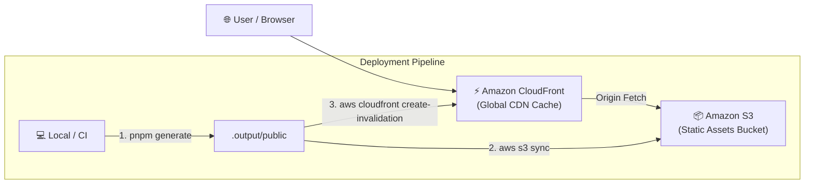

# 🚀 Shubham More - Personal Portfolio & Blog

A high-performance personal portfolio, projects showcase, and blog built with **Nuxt 4**, **Nuxt UI**, and **Nuxt Content**, hosted on high-throughput **AWS Serverless Infrastructure** (Amazon S3 + AWS CloudFront CDN + API Gateway / Lambda support).

---

## 🏗️ System Architecture

### AWS Architecture Diagram



---

## 🛠️ Infrastructure & Tech Stack

### Frontend Stack
* **Framework**: [Nuxt 4](https://nuxt.com/) (Vue 3, Static Site Generation via Nitro)
* **UI Components**: [Nuxt UI 3/4](https://ui.nuxt.com/) & [Tailwind CSS 4](https://tailwindcss.com/)
* **Content Engine**: [@nuxt/content v3](https://content.nuxt.com/)

### AWS Infrastructure
* **Amazon S3**: Static website hosting & asset storage.
* **Amazon CloudFront**: Global CDN delivering cached static assets with edge invalidation support.

---

## ⚙️ Automated Deployment (`deploy.sh`)

The project uses a high-concurrency, optimized deployment shell script [`deploy.sh`](file:///Users/shubham/Developer/shubham-more.me/deploy.sh):

1. **Static Generation**: Runs `pnpm generate` using Nitro with `NITRO_PRERENDER_CONCURRENCY=128`.
2. **AWS CLI Optimization**: Sets AWS S3 client parameters for maximum throughput (`max_concurrent_requests=128`, `max_queue_size=50000`).
3. **S3 Differential Sync**: Syncs generated `.output/public` files directly to `s3://$AWS_S3_BUCKET` with `--delete`.
4. **CDN Cache Invalidation**: Triggers an AWS CloudFront invalidation for path `/*` so updates propagate globally instantly.

---

## 🛠️ Quick Start & Local Development

### Environment Setup

Copy `.env.aws.example` to `.env.aws` and fill in your AWS credentials & infrastructure variables:

```bash
cp .env.aws.example .env.aws
```

Configuration parameters:

```ini
AWS_REGION=us-east-1
AWS_ACCOUNT_ID=123456789012
AWS_S3_BUCKET=your-s3-bucket-name
AWS_CLOUDFRONT_DISTRIBUTION_ID=E1234567890ABC
AWS_API_GATEWAY_ID=your_api_gateway_id
AWS_API_GATEWAY_ENDPOINT=https://your-api-gateway.execute-api.us-east-1.amazonaws.com/prod
```

### Development

```bash
# Install dependencies
pnpm install

# Start local dev server (http://localhost:3000)
pnpm dev

# Type check & Lint
pnpm typecheck
pnpm lint
```

### Production Build & AWS Deployment

```bash
# Build & preview locally
pnpm build
pnpm preview

# Generate static site & deploy directly to AWS (S3 + CloudFront Invalidation)
pnpm deploy
```

---

## 📜 License

[MIT](file:///Users/shubham/Developer/shubham-more.me/LICENSE) © [Shubham More](https://shubham-more.me)

